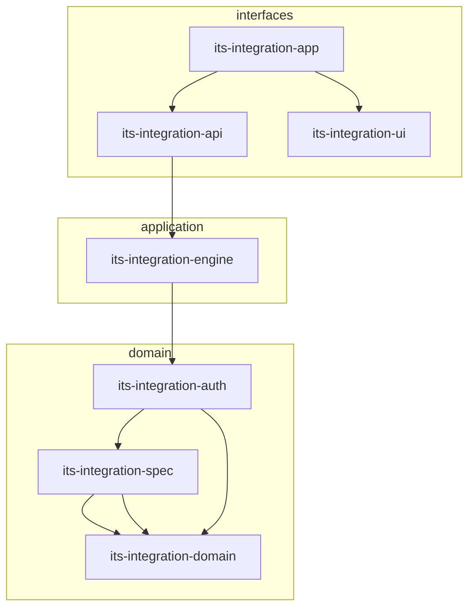
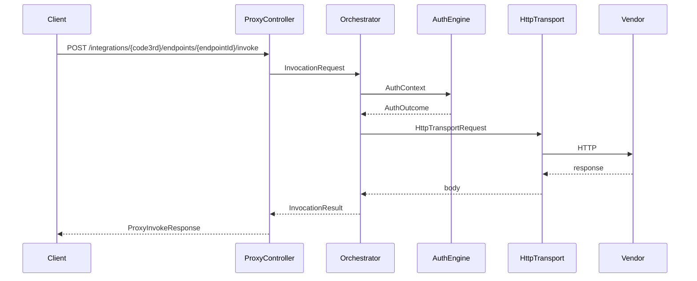

# 架构说明

## 1. 目标

在 JDK 21 上提供可配置、可扩展的第三方对接平台，覆盖：

- 多种 HTTP 认证（含国内厂商私有签名、国密）
- 声明式 Connector Spec（YAML / DB）
- 统一代理 API 与后续管理 UI
- 复杂场景通过 SPI 扩展（大华多步登录、海康 SDK、WebSocket 等）

## 2. 分层与依赖规则（Hexagonal）

**依赖规则（强制）：**

| 模块 | 允许依赖 |
|------|----------|
| domain | 无业务框架 |
| spec | domain |
| auth | domain, spec |
| engine | domain, spec, auth, spring-context |
| api | engine, spring-web；含 `/api/v1/admin` BFF |
| ui | 静态资源 JAR（Vue 构建产物） |
| app | api, ui, spring-boot（**单端口** fat JAR） |

禁止 `domain` → `spring-*`，禁止 `api` → `auth` 直接耦合（经 engine）。

## 3. 运行时调用链

## 4. 核心扩展点

| 扩展点 | 接口 | 用途 |
|--------|------|------|
| AuthProvider | `com.suntek.integration.auth.spi.AuthProvider` | 标准/私有认证 |
| HttpTransport | `com.suntek.integration.engine.transport.HttpTransport` | HTTP 实现可替换 |
| IntegrationOrchestrator | `domain.spi.IntegrationOrchestrator` | 编排策略 |
| ConnectorRegistry | `engine.ConnectorRegistry` | Spec 来源（内存/本地 JDBC） |
| ConnectorConfigStore | `engine.store.ConnectorConfigStore` | 独立持久化端口 |

## 5. 配置模型

- **ConnectorSpec**：`code3rd`、`baseUrl`、`auth`、`endpoints[]`、`response`、`transport`、`transform[]`
- **凭证**：与 Spec 分离，运行时注入 `ConnectorRegistry.credentials`
- **版本**：`connector.version`，支持灰度与回滚（持久化层待实现）

## 6. 非功能

| 项 | 方案 |
|----|------|
| JDK | 21，虚拟线程 `spring.threads.virtual.enabled=true` |
| Spring Boot / Cloud | 4.0.6 / 2025.1.0（见 [DEPENDENCIES.md](./DEPENDENCIES.md)） |
| HTTP | JDK HttpClient（engine 模块） |
| 可观测 | Actuator + 后续 Micrometer/OTLP |
| 国密 | BouncyCastle（auth 模块） |
| 文档 | springdoc OpenAPI 3 |

## 7. 实施阶段

| 阶段 | 交付 |
|------|------|
| P0（当前骨架） | 多模块工程、none 认证、代理 API、YAML 加载 |
| P1 | oauth2、aksk_hmac、md5 等 Profile；DB 持久化 |
| P2（当前） | 独立 JDBC 持久化；thirdpart 迁移（见 [THIRDPART-MIGRATION.md](./THIRDPART-MIGRATION.md)）；Pipeline/Transform/OpenAPI 待办 |
| P3 | SDK/FTP/WebSocket SPI；OpenAPI 导入向导 |

详见 [DEVELOPER.md](./DEVELOPER.md) 与 [adr/001-platform-overview.md](./adr/001-platform-overview.md)。
